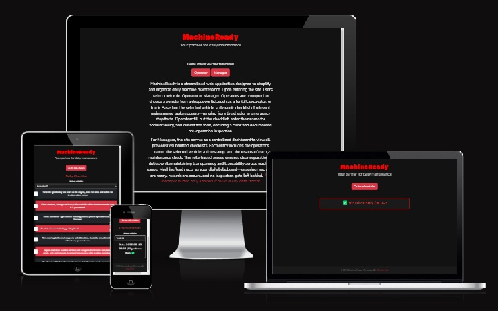
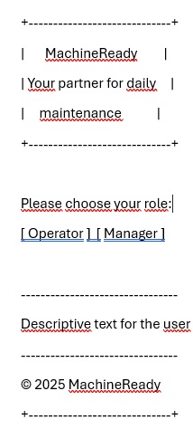
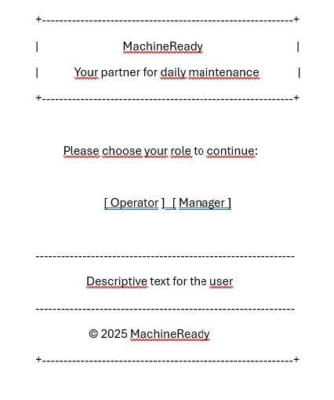
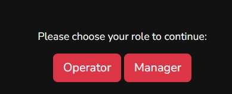
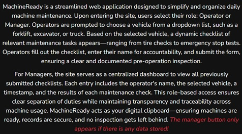
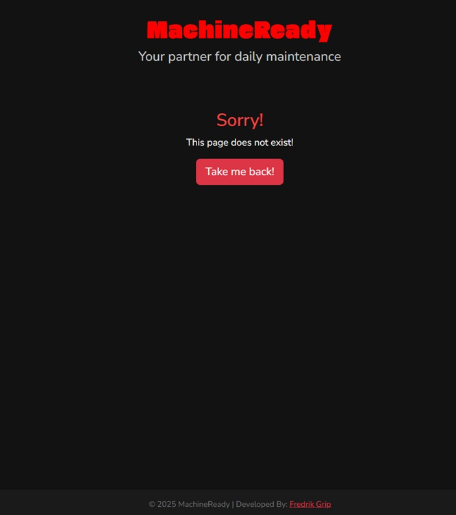
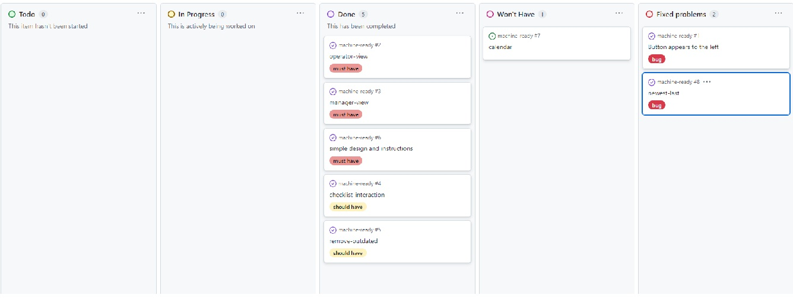

# machine-ready
# [machine-ready](https://fattig-riddare-90.github.io/machine-ready)

Developer: Fredrik Grip ([fattig-riddare-90](https://www.github.com/fattig-riddare-90))

source: [machine-ready amiresponsive](https://ui.dev/amiresponsive?url=https://fattig-riddare-90.github.io/machine-ready)

MachineReady is a streamlined digital tool designed for companies that rely on heavy machinery—such as trucks, excavators, and forklifts—to function efficiently and safely. Its primary purpose is to simplify and standardize the daily inspection routines across an entire fleet.

For machine operators, MachineReady offers a clear, user-friendly checklist that guides them step-by-step through their daily inspection tasks, ensuring nothing is overlooked. For supervisors and managers, it provides a real-time overview of completed inspections, making it easy to verify that all machines have been checked and all operators have fulfilled their responsibilities.

By making inspections intuitive and transparent, MachineReady helps prevent downtime, reduces the risk of mechanical failure, and fosters a culture of accountability. It bridges the gap between daily operations and management oversight—saving time, boosting reliability, and giving everyone peace of mind.

[!IMPORTANT] Since there is no backend to this, the information is stored in localStorage and only accessible to those who filled out the checklist. For this to be a real product for a client there would have to be a backend which to upload the information to instead.

> [!IMPORTANT]
> The examples in these templates are strongly influenced by the Code Institute walkthrough project called "Love Maths".

## UX

### The 5 Planes of UX

#### 1. Strategy

**Purpose**
- Provide operators with a fast and straightforward way to perform daily service checks on different vehicles and machines.
- Ensure that all checklist items are completed before submission.
- Help managers monitor compliance through a clear history view.

**Primary User Needs**
- Quick access to the correct checklist based on machine type.
- Clear visual feedback when all tasks are completed.
- Simple signature and submission process.
- View recent history without being overwhelmed by outdated data.

**Business Goals**
- Streamline daily service routines and reduce the risk of missed inspections.
- Give supervisors an easy way to track accountability and machine readiness.
- Deliver a clean, reliable solution that works well even for users with low tech tolerance.

#### 2. Scope

**[Features](#features)** (see below)

**Content Requirements**
- Clear labels and instructions in English.
- Confirmation messages when tasks are completed.
- Signature input before form submission.
- History view limited to the past 30 days.

#### 3. Structure

**Information Architecture**
- **Start Screen**:
  - Choose role (Operator or Manager).
- **Operator flow**:
  - Select machine type → see checklist → complete tasks → sign and submit → confirmation → back to home screen.

- **Manager flow**:
    - Select machine type → view recent submission history (last 30 days) → see date, signature, and confirmation icon.

**User Flow**
- User arrives at the start screen and selects their role.
- Operator selects a machine and completes the checklist.
- After checking all items, user enters their signature and submits.
- System stores the submission and confirms success.
- Manager selects a machine type to review history.
- Only submissions from the last 30 days are shown, newest first.

#### 4. Skeleton

**[Wireframes](#wireframes)** (see below)

- Start screen with two role buttons.
- Operator view:
    - Dropdown for machine type.
    - Checklist with checkboxes.
    - Signature input field and submit button.
- Manager view:
    - Dropdown for machine type.
    - History list with date, signature, and checkmark for each recent submission.

#### 5. Surface

**Visual Design Elements**
- **[Colours](#colour-scheme)** (see below)
    - Red for buttons to match safety/emergency equipment.
    - White background with dark text for readability.
    - Green checkmarks for completed entries.

- **[Typography](#typography)** (see below)
    - Bold, large headings for clarity.
    - Simple, readable sans-serif font for body text.

### Colour Scheme

The chosen colour scheme prioritizes usability, clarity, and a visual connection to safety-critical environments. Red is used prominently for buttons and interactive elements because it is strongly associated with alerts, urgency, and attention—ideal for an industrial or maintenance-focused application. White and light backgrounds ensure maximum contrast with text, enhancing readability for users in both daylight and low-light conditions. Green checkmarks are used to indicate completed tasks, leveraging the universally understood color association with success and approval. This combination supports quick decision-making and minimizes the risk of user error in a high-responsibility context.

I used [coolors.co](https://coolors.co/080708-3772ff-df2935-fdca40-e6e8e6) to generate my color palette.

- `#121212` background color.
- `#DC3545` buttons (Bootstrap class color).
- `#FF0000` heading.

### Typography

- [Gasoek One](https://fonts.google.com/specimen/Gasoek+One) was used for the primary header.
- [Nunito Sans](https://fonts.google.com/specimen/Nunito+Sans) was used for all other text.

## Wireframes

| Page | Mobile | Desktop |
| --- | --- | --- |
| Home |  |  |

## User Stories

| Target | Expectation | Outcome |
| --- | --- | --- |
| As an operator | I want to quickly find and complete the daily checklist for my assigned vehicle | so that I can ensure it's ready and safe to use at the start of my shift. |
| As a manager | I want to view recent submissions for each machine | so that I can confirm daily maintenance has been performed without needing to ask. |
| As an operator | I want to clearly see which items on the checklist I’ve completed | so that I don’t accidentally miss any steps during the inspection. |
| As a manager | I want outdated submissions to be removed after 30 days | so that the system stays clean and only shows relevant maintenance history. |
| As a first-time user | I want the interface to be simple and self-explanatory | so that I can use the system correctly without needing training or a manual. |

## Features

### Existing Features

| Feature | Notes | Screenshot |
| --- | --- | --- |
| Role selection buttons | Very straightforward, just click and get to work |  |
| Instructions | A text describing how to use the page, very handy for a first-time user |  |
| Vehicle Selection | Appear in both operator and manager view, makes it very easy and user-friendly to select a vehicle |  |
| Checklist | One for each vehicle, a few overlapping items that apply to several vehicles, the list item slides away to the left upon being checked to ensure you don't uncheck it or have to scroll down to use it as you might do this on a phone and need your other hand for other things |  |
| Signature box | This is where you put your name so that the manager can see who has performed the daily maintenance check, you can not submit the list without signing, ensuring accountability |  |
| Submit Button | Sends the information to localStorage for your manager to find |  |
| Submitted Checklists List | A list of the submitted checklists gotten from localStorage |  |
| Go to role choice button | A button that takes you back to the starting view and the role choice buttons, hidden on the actual starting view |  |
| 404 | The 404 error page will indicate when a user has somehow navigated to a page that doesn't exist. This replaces the default GitHub Pages 404 page, and ties-in with the look and feel of the *MachineReady* site by using the same colors. It also has a button which takes you back to the main page |  |

### Future Features

- **Calendar**: Change the manager view to a calendar instead of a straight list, so he can sort the checklists by day aswell as vehicle.
- **Checkmarks on the calendar**:  Makes the overview even more simple, with a green checkmark on the day there is no further inquiry to be done. Whereas an absent checkmark makes it easy to see when daily maintenance has not been performed and the manager can inquire further.

## Tools & Technologies

| Tool / Tech | Use |
| --- | --- |
|  | Generate README and TESTING templates. |
|  | Version control. (`git add`, `git commit`, `git push`) |
|  | Secure online code storage. |
|  | Local IDE for development. |
|  | Main site content and layout. |
|  | Design and layout. |
|  | User interaction on the site. |
|  | Hosting the deployed front-end site. |
|  | Front-end CSS framework for modern responsiveness and pre-built components. |
|  | Help debug, troubleshoot, and explain things. |
|  | Tutorials/Reference Guide |

## Agile Development Process

### GitHub Projects

[GitHub Projects](https://www.github.com/fattig-riddare-90/machine-ready/projects) served as an Agile tool for this project. Through it, EPICs, User Stories, issues/bugs, and Milestone tasks were planned, then subsequently tracked on a regular basis using the Kanban project board.

### GitHub Issues

[GitHub Issues](https://www.github.com/fattig-riddare-90/machine-ready/issues) served as an another Agile tool. There, I managed my User Stories and Milestone tasks, and tracked any issues/bugs.

| Link |
| --- |
|  |
|  |

### MoSCoW Prioritization

I've decomposed my Epics into User Stories for prioritizing and implementing them. Using this approach, I was able to apply "MoSCoW" prioritization and labels to my User Stories within the Issues tab.

- **Must Have**: guaranteed to be delivered - required to Pass the project (*max ~60% of stories*)
- **Should Have**: adds significant value, but not vital (*~20% of stories*)
- **Could Have**: has small impact if left out (*the rest ~20% of stories*)
- **Won't Have**: not a priority for this iteration - future features

## Testing

> [!NOTE]
> For all testing, please refer to the [TESTING.md](TESTING.md) file.

## Deployment

### GitHub Pages

The site was deployed to GitHub Pages. The steps to deploy are as follows:

- In the [GitHub repository](https://www.github.com/fattig-riddare-90/machine-ready), navigate to the "Settings" tab.
- In Settings, click on the "Pages" link from the menu on the left.
- From the "Build and deployment" section, click the drop-down called "Branch", and select the **main** branch, then click "Save".
- The page will be automatically refreshed with a detailed message display to indicate the successful deployment.
- Allow up to 5 minutes for the site to fully deploy.

The live link can be found on [GitHub Pages](https://fattig-riddare-90.github.io/machine-ready).

### Local Development

This project can be cloned or forked in order to make a local copy on your own system.

#### Cloning

You can clone the repository by following these steps:

1. Go to the [GitHub repository](https://www.github.com/fattig-riddare-90/machine-ready).
2. Locate and click on the green "Code" button at the very top, above the commits and files.
3. Select whether you prefer to clone using "HTTPS", "SSH", or "GitHub CLI", and click the "copy" button to copy the URL to your clipboard.
4. Open "Git Bash" or "Terminal".
5. Change the current working directory to the location where you want the cloned directory.
6. In your IDE Terminal, type the following command to clone the repository:
	- `git clone https://www.github.com/fattig-riddare-90/machine-ready.git`
7. Press "Enter" to create your local clone.

Alternatively, if using Gitpod, you can click below to create your own workspace using this repository.

**Please Note**: in order to directly open the project in Gitpod, you should have the browser extension installed. A tutorial on how to do that can be found [here](https://www.gitpod.io/docs/configure/user-settings/browser-extension).

#### Forking

By forking the GitHub Repository, you make a copy of the original repository on our GitHub account to view and/or make changes without affecting the original owner's repository. You can fork this repository by using the following steps:

1. Log in to GitHub and locate the [GitHub Repository](https://www.github.com/fattig-riddare-90/machine-ready).
2. At the top of the Repository, just below the "Settings" button on the menu, locate and click the "Fork" Button.
3. Once clicked, you should now have a copy of the original repository in your own GitHub account!

### Local VS Deployment

There are no remaining major differences between the local version when compared to the deployed version online.

## Credits

### Content

| Source | Notes |
| --- | --- |
| [Markdown Builder](https://markdown.2bn.dev) | Help generating Markdown files |
| [Chris Beams](https://chris.beams.io/posts/git-commit) | "How to Write a Git Commit Message" |
| [Interactive Frontend Development](https://codeinstitute.net) | Code Institute walkthrough project inspiration |
| [JavaScript30](https://javascript30.com) | Additional JS help |
| [Bootstrap](https://getbootstrap.com) | Various components / responsive front-end framework |
| [ChatGPT](https://chatgpt.com) | Help with code logic and explanations |
| [Sticky Footer](https://css-tricks.com/a-clever-sticky-footer-technique/) | Making the footer stick to the bottom of the page |
| [Google Fonts](https://fonts.google.com/)| The fonts for the site |

### Media

| Source | Notes |
| --- | --- |
| [favicon.io](https://favicon.io) | Generating the favicon |

### Acknowledgements

- I would like to thank my Code Institute mentor, [Tim Nelson](https://www.github.com/TravelTimN) for the support throughout the development of this project.
- I would like to thank my family for their patience and for not disturbing me too much throughout the project.

