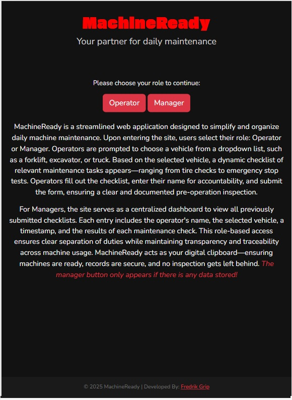
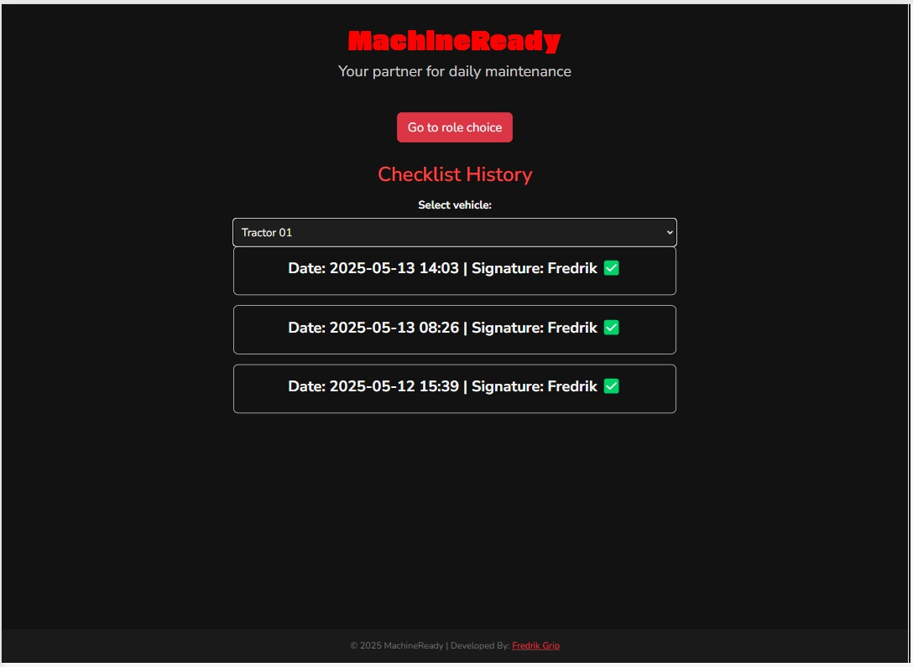
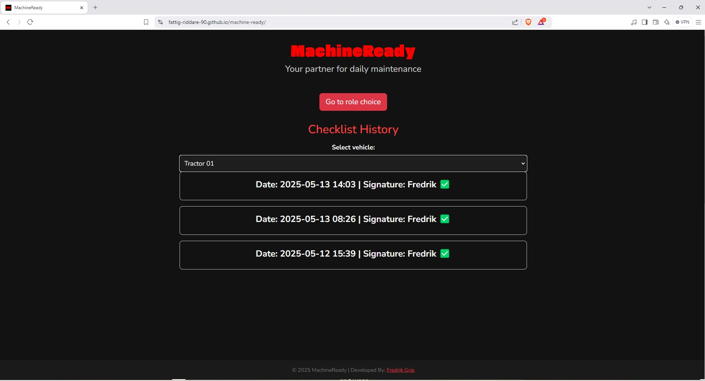
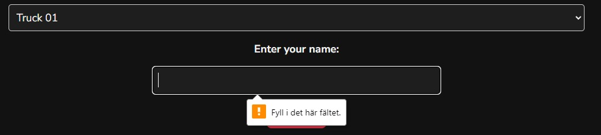
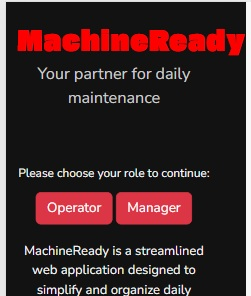

# Testing

> [!NOTE]
> Return back to the [README.md](README.md) file.

## Code Validation

### HTML

I have used the recommended [HTML W3C Validator](https://validator.w3.org) to validate all of my HTML files.

| Directory | File | URL | Screenshot | Notes |
| --- | --- | --- | --- | --- |
|  | [404.html](https://github.com/fattig-riddare-90/machine-ready/blob/main/404.html) | [HTML Validator](https://validator.w3.org/nu/?doc=https://fattig-riddare-90.github.io/machine-ready/404.html) |  | Notes (if applicable) |
|  | [index.html](https://github.com/fattig-riddare-90/machine-ready/blob/main/index.html) | [HTML Validator](https://validator.w3.org/nu/?doc=https://fattig-riddare-90.github.io/machine-ready/index.html) |  | Notes (if applicable) |

### CSS

I have used the recommended [CSS Jigsaw Validator](https://jigsaw.w3.org/css-validator) to validate all of my CSS files.

| Directory | File | URL | Screenshot | Notes |
| --- | --- | --- | --- | --- |
| assets | [style.css](https://github.com/fattig-riddare-90/machine-ready/blob/main/assets/css/style.css) | [CSS Validator](https://jigsaw.w3.org/css-validator/validator?uri=https://fattig-riddare-90.github.io/machine-ready) |  | Notes (if applicable) |

### JavaScript

I have used the recommended [JShint Validator](https://jshint.com) to validate all of my JS files.

| Directory | File | URL | Screenshot | Notes |
| --- | --- | --- | --- | --- |
| assets | [manager.js](https://github.com/fattig-riddare-90/machine-ready/blob/main/assets/js/manager.js) | N/A |  | Notes (if applicable) |
| assets | [operator.js](https://github.com/fattig-riddare-90/machine-ready/blob/main/assets/js/operator.js) | N/A |  | Notes (if applicable) |
| assets | [start.js](https://github.com/fattig-riddare-90/machine-ready/blob/main/assets/js/start.js) | N/A |  | Notes (if applicable) |
| assets | [utility.js](https://github.com/fattig-riddare-90/machine-ready/blob/main/assets/js/utility.js) | N/A |  | This code is imported into other documents |

## Responsiveness

I've tested my deployed project to check for responsiveness issues.

| Page | Mobile | Tablet | Desktop | Notes |
| --- | --- | --- | --- | --- |
| Start |  |  |  | Works as expected |
| Operator |  |  |  | Works as expected |
| Manager |  |  |  | Works as expected |
| 404 |  |  |  | Works as expected |

## Browser Compatibility

I've tested my deployed project on multiple browsers to check for compatibility issues.

| Page | Brave | Edge | Firefox | Notes |
| --- | --- | --- | --- | --- |
| Start |  |  |  | Works as expected |
| Operator |  |  |  | Works as expected |
| Manager |  |  |  | Works as expected 
| 404 |  |  |  | Works as expected |

## Lighthouse Audit

I've tested my deployed project using the Lighthouse Audit tool to check for any major issues. Some warnings are outside of my control, and mobile results tend to be lower than desktop.

| Page | Mobile | Desktop |
| --- | --- | --- |
| Start |  |  |
| 404 |  |  |

## Defensive Programming

Defensive programming was manually tested with the below user acceptance testing:

| Page/Feature | Expectation | Test | Result | Screenshot |
| --- | --- | --- | --- | --- |
| Operator button | Expect to be taken to the operator view | Clicked the button | Was taken to operator view |  |
| Manager button | Expect to be taken to the manager view | Clicked the button | Was taken to the manager view |  |
| Checklist Items | Expected to no submit until all are checked | Tested to submit before checking all items | Worked like a charm |  |
| Signature box | Expect no submit until text is added | Tested to submit without signing | Worked as expected |  |
| Go to Role Choice button | Expect to be taken back to starting view | Clicked the button | Was taken to the start view |  |
| Vehicle Select list | Expect to see a list of vehicles | Clicked the list | Saw a list of vehicles |  |
| Generated list of submitted checklists | Expect to see generated list of submitted checklists when choosing a vehicle | Chooses a vehicle in manager view | Sees a list |  |
| 404 Take me back button | Expect to be taken to the main page | Clicked the button | Was taken to the main page |  |

## User Story Testing

| Target | Expectation | Outcome | Screenshot(if possible) |
| --- | --- | --- | --- |
| As an operator | I want to quickly find and complete the daily checklist for my assigned vehicle | so that I can ensure it's ready and safe to use at the start of my shift. |  |
| As a manager | I want to view recent submissions for each machine | so that I can confirm daily maintenance has been performed without needing to ask. |  |
| As an operator | I want to clearly see which items on the checklist I’ve completed | so that I don’t accidentally miss any steps during the inspection. |  |
| As a manager | I want outdated submissions to be removed after 30 days | so that the system stays clean and only shows relevant maintenance history. | localStorage is cleared of entries older than 30 days |
| As a first-time user | I want the interface to be simple and self-explanatory | so that I can use the system correctly without needing training or a manual. |  |

## Bugs

### Fixed Bugs

I've used [GitHub Issues](https://www.github.com/fattig-riddare-90/machine-ready/issues) to track and manage bugs and issues during the development stages of my project.

All previously closed/fixed bugs can be tracked [here](https://www.github.com/fattig-riddare-90/machine-ready/issues?q=is%3Aissue+is%3Aclosed+label%3Abug).

### Unfixed Bugs

Any remaining open issues can be tracked [here](https://www.github.com/fattig-riddare-90/machine-ready/issues).

### Known Issues

| Issue | Screenshot |
| --- | --- |
| On devices smaller than 375px, the page content continue to get smaller, but the header does not follow along. But the page works on an iPhone SEv3 (which is small) so it is acceptable |  |
| When validating HTML with a semantic `<section>` element, the validator warns about lacking a header `h2-h6`. This is acceptable. |  |

> [!IMPORTANT]
> There are no remaining bugs that I am aware of, though, even after thorough testing, I cannot rule out the possibility.

